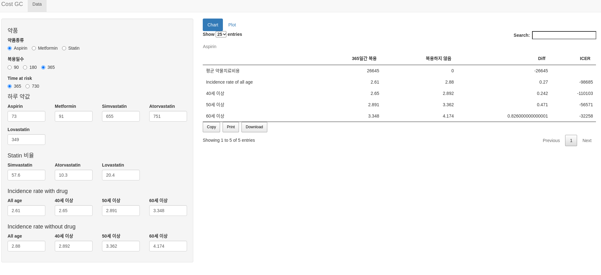
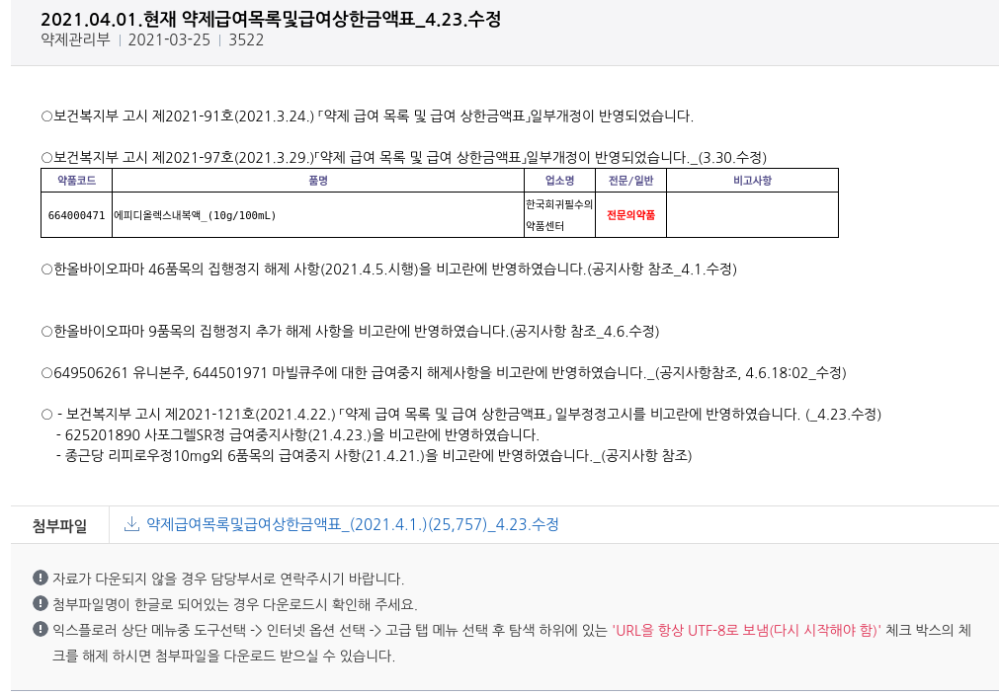
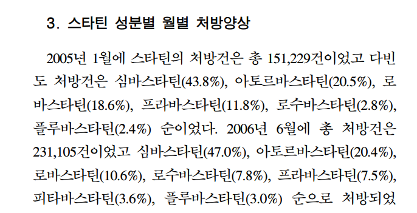

```{r setup, include=FALSE}
options(htmltools.dir.version = FALSE)
knitr::opts_chunk$set(echo = FALSE, fig.align = "center")
library(knitr);library(DT);library(shiny)
```


layout: true

<div class="my-footer"><span><a href="https://www.zarathu.com">Zarathu Co.,Ltd</a>   
&emsp;&emsp;&emsp;&emsp;&emsp;&emsp;&emsp;&emsp;&emsp;&emsp;&emsp;&emsp;&emsp;
&emsp;&emsp;&emsp;&emsp;&emsp;&emsp;&emsp;&emsp;&emsp;&emsp;&emsp;&emsp;&emsp;
<a href="https://github.com/jinseob2kim">김진섭</a></span></div> 


---

# Executive summary

.large[CDM 결과 Aspirin/Metformin/Statin 복용이 위암사망을 감소시킴을 확인, 경제성평가웹 제작.]

--

.large[
- CDM: 복용/비복용군 Incidence 얻음.

- 최소 약물 복용기간(90, 180, 365일), 최초 복용나이(40, 50, 60대) 따른 비교.

- 약물가격은 [심평원 약제급여정보](https://www.hira.or.kr/bbsDummy.do?pgmid=HIRAA030014050000&brdScnBltNo=4&brdBltNo=1638&pageIndex=1#none) 이용하여 평균, Statin은 3종류 고려.

- ICER = 비용차이 / Incidence 차이 

]

--

.large[
 모형(Decision tree, Markov model) 은 무엇인지, QALY 적용 어떻게?
]


---
# ShinyApp 개발중

<center><a href="http://147.47.68.165:1111/doctorssi/costdrug/"></center>

---

class: center, middle

# CDM

---
# Data

.large[
CDM 변환된 공단 100만표본코호트 1.0 이용

- 타겟군: Aspirin(또는 metformin/statin) 연속복용 XX 일 이상

- 비교균: **Any drug** 연속복용 XX 일 이상

- **30일 이내 재복용은 연속복용**으로 간주

- 결과: 위암발생
]

---
# Analysis

.large[
다양한 옵션 동시분석가능한 CDM

- 복용기간 90, 180, 365일 

- 나이: 전체, 40/50/60대 복용시작 

- 최소관찰기간: 365, 730일 

- 분석방법: PS matching(1:1, 1:4), PS stratification 
]

--
.large[
Incidence 는 1:4 PS matching 결과 이용 (단위, 1000 명당)
]

--
.large[
**경제성평가 모형은 무엇인지? Decision tree? Markov?**
]


---
class: center, middle

# 약물가격


---
# 약제급여목록표

<center><a href="https://www.hira.or.kr/bbsDummy.do?pgmid=HIRAA030014050000&brdScnBltNo=4&brdBltNo=1638&pageIndex=1#none"></center>


---

```{r, echo=F}
rmarkdown::paged_table(head(data.table::fread("drug_cost.csv"), 100))
```


---
# 평균계산

.large[
- 각 약물에 해당하는 가격들을 평균내서 이용(매일 1번 복용 가정)

- Statin 은 Simvastatin/Atorvastatin/Lovastatin 따로 계산. 비율은 [우리나라 노인환자에서 스타틴 처방양상](https://kmbase.medric.or.kr/Main.aspx?menu=01&d=KMBASE&m=VIEW&i=1011320120050010015) 참고
]

<center></center>


---
# ICER

.large[

$\frac{Cost 차이}{Incidence 차이}$: 발생률 0.1 내리기 위해 얼마 필요한가?
- 더 직관적인 지표 필요
]

--
.large[
QALY 이용 가능?
- QALY 설문조사는 불가능. 
- 어떤 문헌?
- Life-Years Gained 는 가능할지.
]


---
# Executive summary

.large[CDM 결과 Aspirin/Metformin/Statin 복용이 위암사망을 감소시킴을 확인, 경제성평가웹 제작.

- CDM: 복용/비복용군 Incidence 얻음.

- 최소 약물 복용기간(90, 180, 365일), 최초 복용나이(40, 50, 60대) 따른 비교.

- 약물가격은 [심평원 약제급여정보](https://www.hira.or.kr/bbsDummy.do?pgmid=HIRAA030014050000&brdScnBltNo=4&brdBltNo=1638&pageIndex=1#none) 이용하여 평균, Statin은 3종류 고려.

- ICER = Incidence 차이 / 비용차이  

 모형(Decision tree, Markov model) 은 무엇인지, QALY 적용 어떻게?
]

---

class: center, middle

# END
