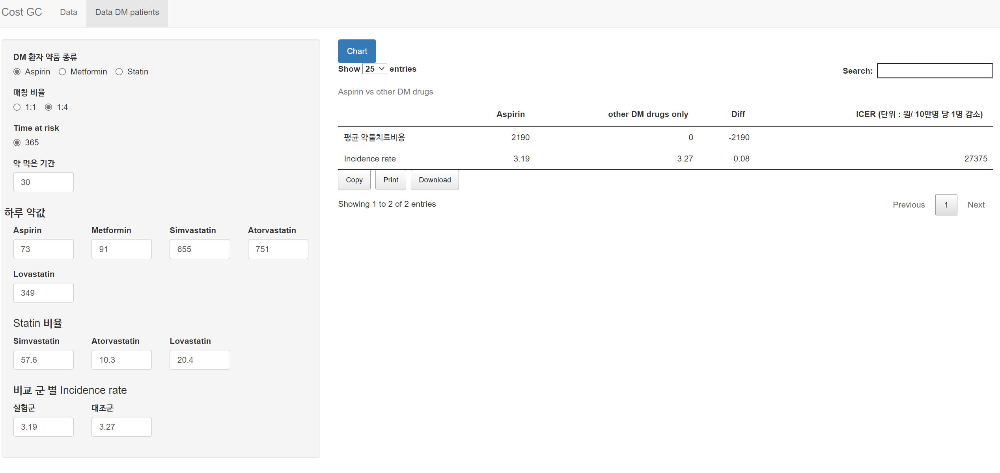
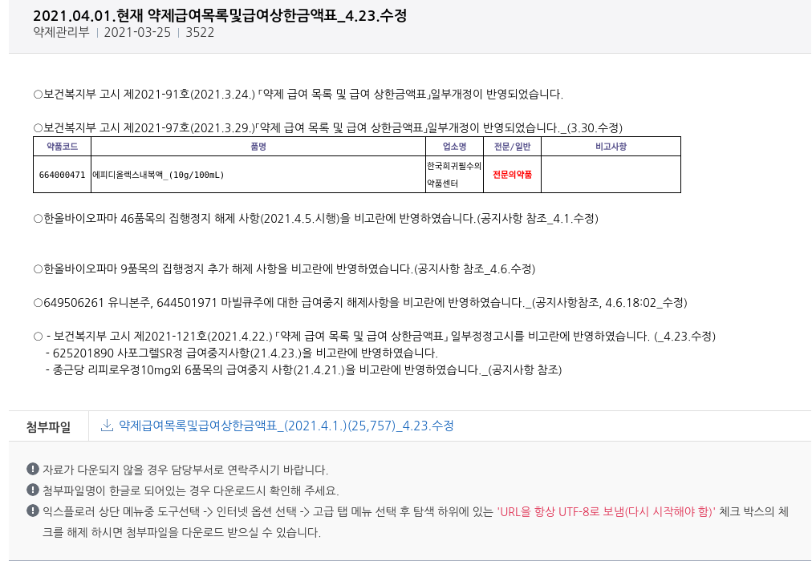
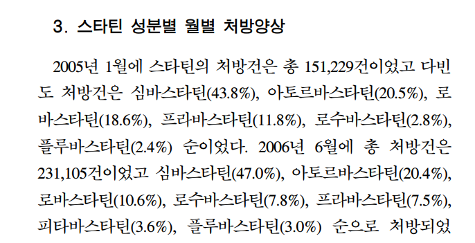

```{r setup, include=FALSE}
options(htmltools.dir.version = FALSE)
knitr::opts_chunk$set(echo = FALSE, fig.align = "center")
library(knitr);library(DT);library(shiny)
```


layout: true

<div class="my-footer"><span><a href="https://www.zarathu.com">Zarathu Co.,Ltd</a>   
&emsp;&emsp;&emsp;&emsp;&emsp;&emsp;&emsp;&emsp;&emsp;&emsp;&emsp;&emsp;&emsp;
&emsp;&emsp;&emsp;&emsp;&emsp;&emsp;&emsp;&emsp;&emsp;&emsp;&emsp;&emsp;&emsp;
<a href="https://github.com/jinseob2kim">김진섭</a></span></div> 


---

# Executive summary

.large[
CDM 결과 Aspirin/Metformin/Statin 복용이 위암사망을 감소시킴을 확인, 경제성평가 업데이트.
- ICER 단위 명확히: 원/ 10만명 당 1명 감소

- Decision tree: 위암 발생에서 종료

- DM 환자만 대상으로 


]


---
# ShinyApp

<center><a href="http://147.47.68.165:1111/doctorssi/costdrug/"></center>


---
# Data

.large[
CDM 변환된 공단 100만표본코호트 1.0 이용

**DM 치료환자 중**

- 타겟군: Aspirin(또는 metformin/statin) 연속복용 30 일 이상

- 비교균: 나머지

- 결과: 위암발생
]


---
# Analysis

.large[
다양한 옵션 동시분석가능한 CDM

- 복용기간 30일 

- 나이: 전체, 나이별 X

- 최소관찰기간: 365

- 분석방법: PS matching(1:4 결과 이용)
]

---
# ICER: No QALY

.large[
비용-효과분석(Cost-effectiveness)
- 단위: **원/ 10만명 당 1명 감소**

**Decision tree**
- 위암 발생만 고려
- Markov model 은 발생, 회복, 사망 등 cycle을 통합 고려.
]


---
# 약물은 이전과 동일

<center><a href="https://www.hira.or.kr/bbsDummy.do?pgmid=HIRAA030014050000&brdScnBltNo=4&brdBltNo=1638&pageIndex=1#none"></center>


---

```{r, echo=F}
rmarkdown::paged_table(head(data.table::fread("drug_cost.csv"), 100))
```


---
# 평균계산

.large[
- 각 약물에 해당하는 가격들을 평균내서 이용(매일 1번 복용 가정)

- Statin 은 Simvastatin/Atorvastatin/Lovastatin 따로 계산. 비율은 [우리나라 노인환자에서 스타틴 처방양상](https://kmbase.medric.or.kr/Main.aspx?menu=01&d=KMBASE&m=VIEW&i=1011320120050010015) 참고
]

<center></center>

---

# Executive summary

.large[
CDM 결과 Aspirin/Metformin/Statin 복용이 위암사망을 감소시킴을 확인, 경제성평가 업데이트.
- ICER 단위 명확히: 원/ 10만명 당 1명 감소

- Decision tree: 위암 발생에서 종료

- DM 환자만 대상으로 

]

---

class: center, middle

# END
